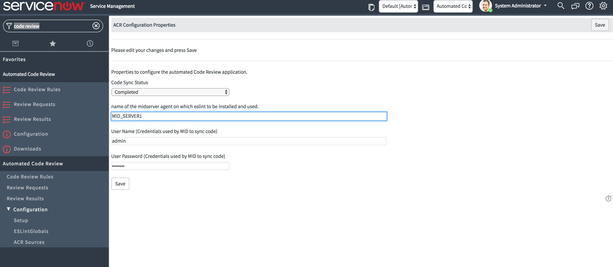
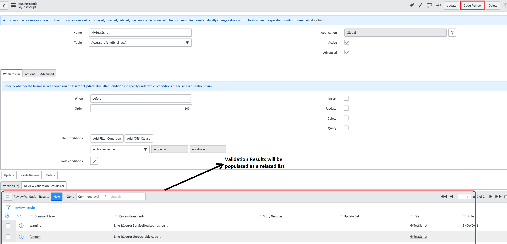
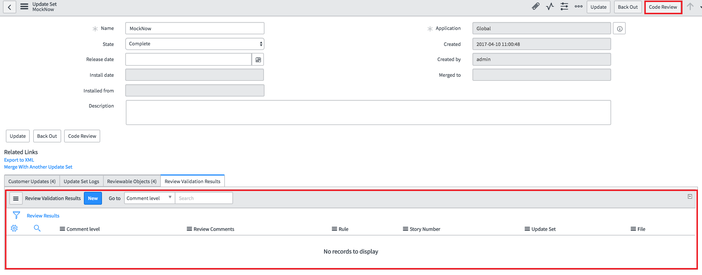
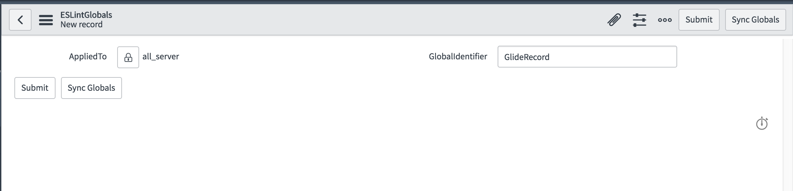
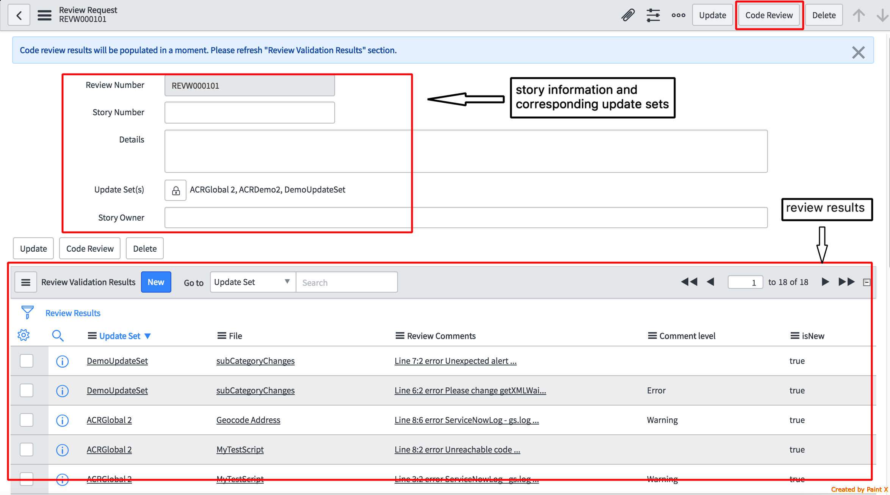
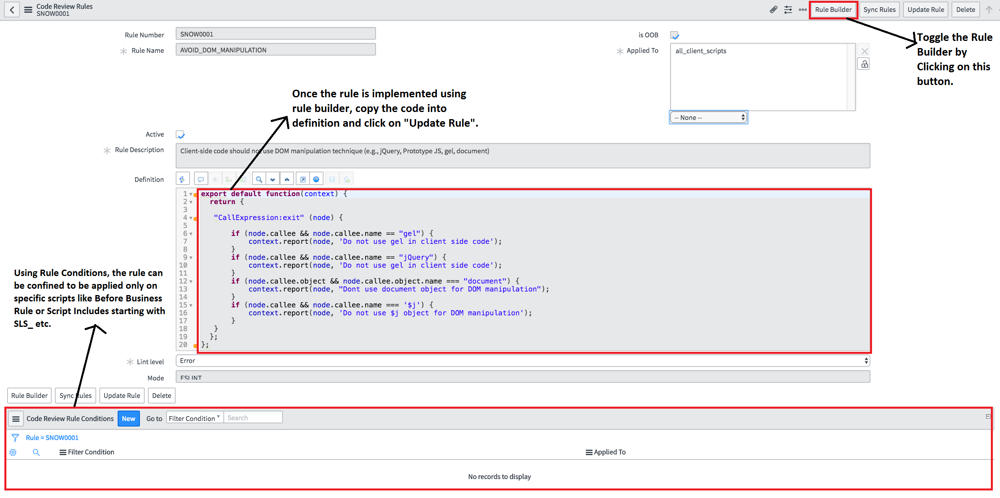
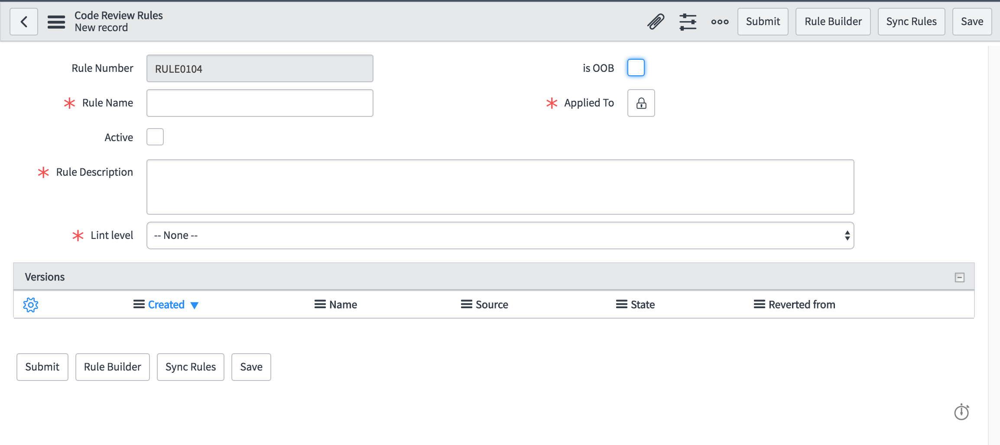
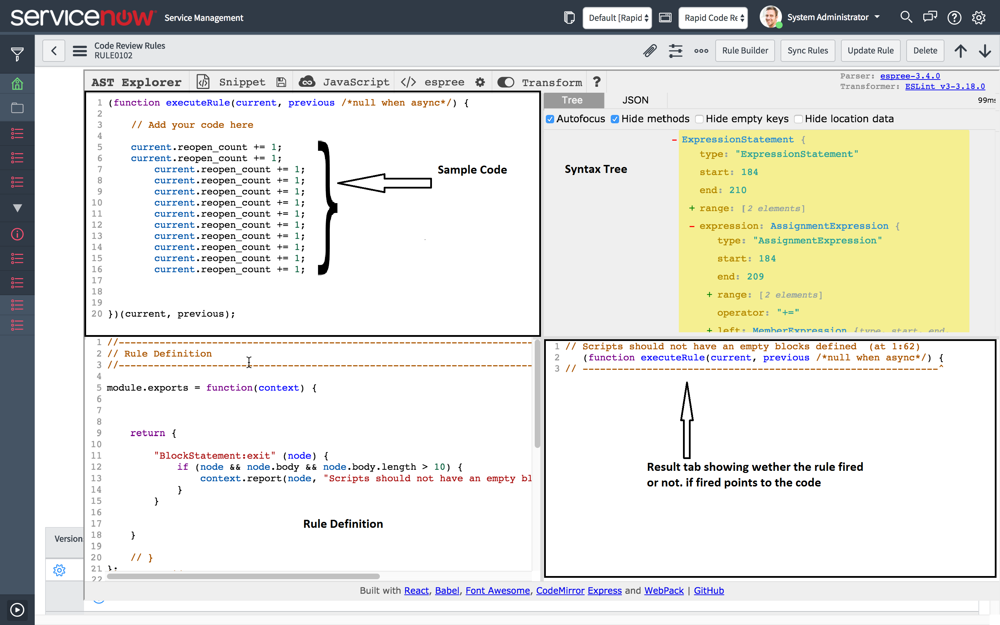
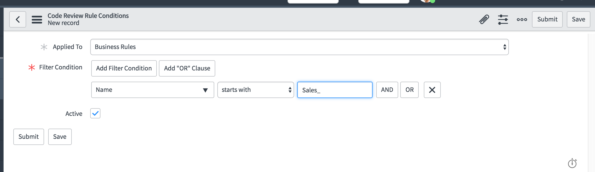

# Rapid Code Review (RcR)

An application for code linting and reviewing with fully customizable rules for every ServiceNow developer/reviewer.

## Install Notes:

* Download the update sets from https://github.com/SN-ITLabs/RcR/tree/master/Dist and install on your instance.
* Pre-requisites: 
     1. Need to have a MID Server configured to your instance. 
     2. PHP (https://www.mamp.info) 
     3. Installing ESLint (http://eslint.org) commands and installed globally and running on the machine where the MID Server is configured.
          1. *Windows* - (via Command prompt as an Administrator)
               1. run the command  *>npm install eslint --save-dev* from agent folder.
               2. add *"<Agent folder>/node_modules/.bin"* to the environment variable *"PATH"*
          2. *Linux*
               1. run the command with sudo access: *>sudo npm install -g eslint*
               
* Setup the application on MID Server by following the below steps:
     1. System Administrator needs to change the scope to "Rapid Code Review". 
     2. Go to Navigator -> Rapid Code Review -> Setup
     3. Provide the name of the MID Server used for code reviewing along with the integration user credentials. 
     Note: Integration user needs to have *x_snc_rcr.CodeSyncAdmin* role.
     4. Change the "Code Sync Status" from "Not Initialized" to "Intialized" and
     5. Click on Save. Wait for couple of minutes and refresh the page to see if the status changed to "Completed".
     
     
 
 
## About:

*RcR* is designed for developers to comply with the best practices recommended by the ServiceNow platform along with the customizable rule development capability for adding new rules specific to your team or company coding standands and practices.

*Every developer* can do the code reviewing on a single entity (Script Include, Business Rule, UI Script, Client Script etc) or on the updateSet to fix the non-compliant practices then and there. 

*Every reviewer* can do the code reviewing on multiple updateSets and the developer will have the visibility of the review validation results simultaneously to act upon in brining the highest quality of code quickly.

## Developer Persona: (Role required: *x_snc_rcr.Developer*)

1. Developers can click on *"Code Review"* button on the script entities (Business Rules, Script Includes, Client Scripts and UI Scripts) and find the validation results directly on the script entity to act on accordingly.

 
 
2. Developers can also click on *"Code Review"* button on the appropriate updateSet to validate the rules against all the script entities in that updateSet so as to find and fix the validation errors related to that updateSet.

 
  
 3. Developers needs to create an entry in *ESLintGlobals* table like the following to inform ESLint about the predefined variables.

## Reviewer Persona: (Role required: *x_snc_rcr.Reviewer*)

Reviewer can review the code spanning across multipe updateSets using the Review Request module by creating a review request with the appropriate details like Story number, Story Owner and the list of update sets to be considered as an unit of work to be reviewed. Once the request is created, Reviewer can request for *"Code Review"* using the button on the request form and the validation results will be populated under *"Review Results"* which can then be worked on by the respective developer. Reviewer can click on the *"Code Review"* button on the Review Request form any number of times to re-validate the status of the code changes.

 
 
 
## Rules Administrator Persona: (Role required: *x_snc_rcr.RuleAdministrator*)

Rule Administrator can maintain the Review Rules with the below capabilities:

     1. Modify the OOTB rules (OOTB rules have their rule name start with SNOW) by either deactivating/activating the rules or changing the level of the error logging (ERROR, WARNING, INFO).
     
     2. Create and modify the definitions of the custom rules
     
     3. Delete custom rules
     

     
     
### Rules Development

     ESLint rules work on the AST (Abstract Syntax Tree) which provides the tree representation of the entire code to be evaluated and the API is provided to write the rules by tranversing the Syntax tree to implement the rule specification.
Developers can use the links provided in the *Resources* Section to start learning on how to write the custom rules.
This application provides the Rule Builder interface which can be used to implement new rules on the go along with testing the rule with the sample code snippet on the same interface. 

the following steps will illustrate how to create a new Rule

1. Navigate to Rapid code Review -> Code Review Rules List and click on New
2. fill in the mandatory fields as applicable and hit save. Only then Defnition fields shows up.

3. upon updating rule, always use Update rule UI Action. and Sync Rules UI Action for Explicit Sync of rules to MID server.
4. writing a rule using rule builder.

5. after creating a rule, one can add conditions under the Code Review Rule Conditions related list. Hit New to see a screen like below.
fill in appropriate values based on conditional linting requirements.

## Resources

To develop new eslint rules using the AST (Abstract Syntax Tree):
### http://eslint.org/docs/developer-guide/working-with-rules
### https://astexplorer.net

### Troubleshooting
1. An ES lint rule can be defined included in to rule engine in different formats viz.,
     1. export default function
     2. module.export (explicit scope creation in definition)
     3. module.export = function (context) (using implicit context passed by eslint)
     
     for the current(1.0) release we encourage rule developers to stick to the 3rd way of defining the rules.
2. Check for Null : Ensure every property/Object that is involved in decision making is not null. This is a trivial null check in javascript yet plays a key role in rule defining. Unsafe access of properties can result in rule malfucntion and a lot of linting errors will be logged in review results.

 example : 
 
 reference.identifier.name === gr && reference.identifier.parent.init  --> is an unsafe expression
   
  where as,
   
 reference.identifier && reference.identifier.name === gr && reference.identifier.parent && reference.identifier.parent.init --> is a safe expression
     

## Wish list for Rcr 2.0

                1. Capability to scan scoped applications along with update sets and individual artefacts.
                2. Change the MID server side rule validation logic from PHP to Java/Javascript code for platform consistency.
                3. Addition of more OOTB rules.
                4. Configuration of OOTB Eslint rules

## License:

MIT
